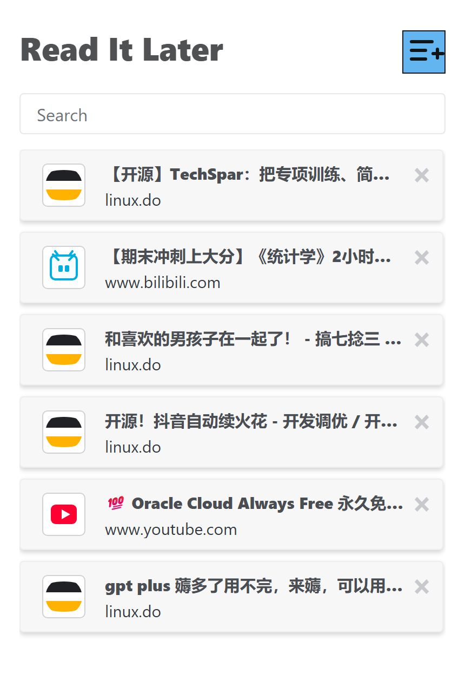

# Read It Later

[English](#english) | [中文](#中文)

---

## English

A minimal, elegant Chrome extension for saving pages to read later. Built with vanilla JavaScript, no dependencies.



### ✨ Features

- **One-click save** — Click the extension icon or press `Alt+1` to instantly save the current page
- **Quick toggle** — Already saved? Click again to remove it
- **Keyboard shortcut** — `Alt+1` to save without opening the popup (fastest way!)
- **Local storage** — All data stays on your device, completely private
- **Clean interface** — Golden ratio proportions (1:1.618) with elegant Playfair Display typography
- **Fast search** — Filter saved pages by title or URL
- **Smart deduplication** — URLs are normalized to prevent duplicates

### 📦 Installation

1. Download or clone this repository
2. Open Chrome and navigate to `chrome://extensions/`
3. Enable "Developer mode" in the top right
4. Click "Load unpacked" and select the extension folder
5. The Read It Later icon will appear in your toolbar

### 🚀 Usage

**Save a page:**
- Click the extension icon, then click the "+" button
- Or press `Alt+1` anywhere on the page (no popup needed!)

**Remove a page:**
- Click the "+" button again on an already-saved page
- Or press `Alt+1` to toggle it off

**Open a saved page:**
- Click the extension icon to see your list
- Click any entry to open it

**Search:**
- Type in the search box to filter by title or URL

### ⌨️ Keyboard Shortcuts

- `Alt+1` — Quick save/remove current page (works without opening popup)
- `Alt+Shift+R` — Open Read It Later popup

You can customize these shortcuts in `chrome://extensions/shortcuts`.

### 🛠️ Technical Details

- **Manifest V3** — Built for the latest Chrome extension standards
- **No external dependencies** — Pure vanilla JavaScript
- **Local-first** — Uses `chrome.storage.local` API, no cloud sync
- **Privacy** — No tracking, no analytics, no network requests
- **Golden ratio design** — Popup dimensions 380×615 (1:1.618)

### 📁 Project Structure

```
read-it-later-extension/
├── manifest.json          # Extension configuration
├── popup.html            # Main UI
├── popup.js              # UI logic
├── background.js         # Service worker for keyboard shortcuts
├── read-later-core.js    # Core data logic
├── styles.css            # UI styling
└── icons/                # Extension icons
```

### 🧪 Verification

```powershell
node --test tests\*.test.js
node --check popup.js read-later-core.js background.js
```

### 📝 License

MIT License - Feel free to use and modify as you wish.

---

## 中文

一个极简优雅的 Chrome 扩展，用于保存稍后阅读的页面。纯 JavaScript 实现，无任何依赖。


### ✨ 功能特性

- **一键保存** — 点击扩展图标或按 `Alt+1` 即可保存当前页面
- **快速切换** — 已保存的页面再次点击即可删除
- **键盘快捷键** — `Alt+1` 无需打开弹窗即可保存（最快方式！）
- **本地存储** — 所有数据存储在本地，完全私密
- **简洁界面** — 黄金分割比例（1:1.618）+ Playfair Display 优雅字体
- **快速搜索** — 按标题或 URL 过滤已保存页面
- **智能去重** — URL 自动标准化，避免重复保存

### 📦 安装方法

1. 下载或克隆本仓库
2. 打开 Chrome 浏览器，进入 `chrome://extensions/`
3. 开启右上角的"开发者模式"
4. 点击"加载已解压的扩展程序"，选择本扩展文件夹
5. Read It Later 图标会出现在工具栏

### 🚀 使用方法

**保存页面：**
- 点击扩展图标，然后点击"+"按钮
- 或者直接按 `Alt+1`（无需打开弹窗！）

**删除页面：**
- 在已保存的页面上再次点击"+"按钮
- 或者按 `Alt+1` 切换删除

**打开已保存页面：**
- 点击扩展图标查看列表
- 点击任意条目即可打开

**搜索：**
- 在搜索框输入关键词，按标题或 URL 过滤

### ⌨️ 键盘快捷键

- `Alt+1` — 快速保存/删除当前页面（无需打开弹窗）
- `Alt+Shift+R` — 打开 Read It Later 弹窗

你可以在 `chrome://extensions/shortcuts` 自定义快捷键。

### 🛠️ 技术细节

- **Manifest V3** — 使用最新的 Chrome 扩展标准
- **无外部依赖** — 纯原生 JavaScript
- **本地优先** — 使用 `chrome.storage.local` API，无云同步
- **隐私保护** — 无追踪、无统计、无网络请求
- **黄金分割设计** — 弹窗尺寸 380×615（1:1.618）

### 📁 项目结构

```
read-it-later-extension/
├── manifest.json          # 扩展配置
├── popup.html            # 主界面
├── popup.js              # 界面逻辑
├── background.js         # 后台 service worker，处理键盘快捷键
├── read-later-core.js    # 核心数据逻辑
├── styles.css            # UI 样式
└── icons/                # 扩展图标
```

### 🧪 验证

```powershell
node --test tests\*.test.js
node --check popup.js read-later-core.js background.js
```

### 📝 开源协议

MIT License - 欢迎自由使用和修改。

