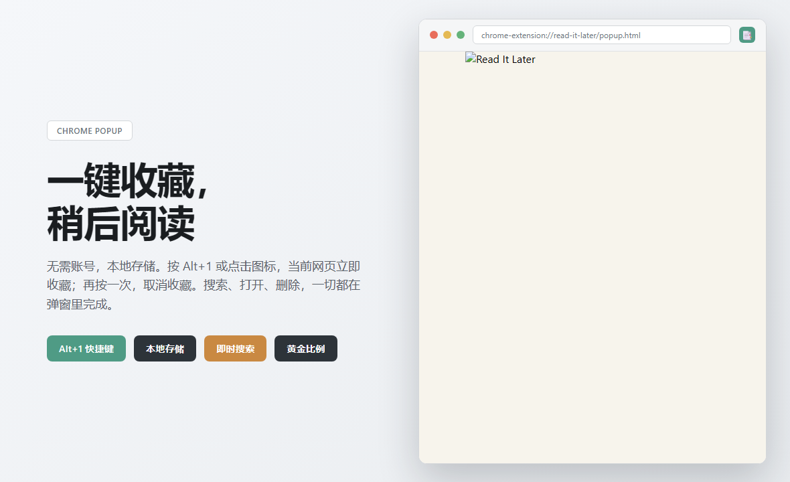

<div align="center">

# 📑 Read It Later

**一键收藏网页，稍后阅读 — 本地存储，无需账号**

[English](#english) | [中文](#中文)

   

</div>

---

## 中文

### ✨ 核心三件事

- **📌 一键收藏** — 点扩展图标或按 `Alt+1`，当前网页立即存到本地
- **🔍 即时搜索** — 输入关键词，标题和网址即时过滤，找到想读的页面
- **🎯 一键直达** — 点击条目直接打开网页，再按 `Alt+1` 取消收藏

### 📸 界面预览

<p align="center">
  
</p>

<details>
<summary>📋 展开完整功能表</summary>

| 功能分类 | 具体能力 | 说明 |
|---------|---------|------|
| **收藏管理** | 一键收藏 | 点击扩展图标的 `+` 按钮或按 `Alt+1` 保存当前页面 |
| | 快速移除 | 鼠标悬停条目时显示删除按钮 `×`，或在已收藏页面按 `Alt+1` 移除 |
| | 自动去重 | 重复收藏同一网页会自动移到列表顶部 |
| | 当前页高亮 | 已收藏的当前页面在列表中高亮显示 |
| **搜索过滤** | 即时搜索 | 输入关键词，标题和网址实时过滤 |
| | 域名识别 | 搜索结果包含域名匹配（如 "github" 找到所有 GitHub 页面） |
| **界面交互** | 黄金比例 | 窗口尺寸 380×615（1:1.618 黄金比例） |
| | 悬停删除 | 删除按钮默认隐藏，鼠标悬停时平滑显示 |
| | 动画反馈 | 添加/删除条目时的淡入淡出动画 |
| | 长标题提示 | 标题超过 35 字符时悬停显示完整文本 |
| **数据存储** | 本地存储 | 数据存在浏览器本地 `chrome.storage.local` |
| | 无需账号 | 不依赖任何外部服务或账号系统 |
| | 跨标签同步 | 多个标签页打开扩展时数据实时同步 |
| **快捷操作** | 键盘快捷键 | `Alt+1` 保存/移除当前页面（无需打开扩展窗口） |
| | 桌面通知 | 保存/移除操作通过系统通知确认 |

</details>

<details>
<summary>🛠 展开完整操作手册</summary>

### 保存网页

| 方式 | 步骤 | 说明 |
|-----|------|------|
| **快捷键（推荐）** | 1. 浏览任意网页<br>2. 按 `Alt+1`<br>3. 桌面通知确认保存 | 最快方式，无需打开扩展窗口 |
| **点击按钮** | 1. 点击工具栏的扩展图标<br>2. 点击右上角的 `+` 按钮<br>3. 完成 | 适合习惯鼠标操作的用户 |

### 移除网页

| 方式 | 步骤 | 说明 |
|-----|------|------|
| **快捷键** | 1. 打开已收藏的网页<br>2. 按 `Alt+1` 再次切换<br>3. 桌面通知确认移除 | 快速移除当前页面 |
| **删除按钮** | 1. 打开扩展窗口<br>2. 鼠标悬停在条目上<br>3. 点击右侧的 `×` 按钮 | 从列表中选择性删除 |

### 打开保存的网页

| 步骤 | 说明 |
|------|------|
| 1. 点击扩展图标查看列表 | 显示所有已保存的页面 |
| 2. 点击任意条目 | 在当前标签页打开该网页 |

### 搜索网页

| 步骤 | 说明 |
|------|------|
| 1. 打开扩展窗口 | 显示搜索框和完整列表 |
| 2. 在搜索框输入关键词 | 结果即时过滤 |
| 3. 搜索范围 | 同时匹配标题和网址（如输入 "github" 可找到所有 GitHub 页面） |

</details>

---

### 📦 安装方法

**从源码安装**（推荐，适合开发者）

1. **克隆或下载**此仓库：
   ```bash
   git clone https://github.com/Aschenbath/Read-It-Later.git
   ```

2. **打开 Chrome** 并访问 `chrome://extensions/`

3. **启用开发者模式**（右上角开关）

4. **点击"加载已解压的扩展程序"**并选择扩展文件夹

5. **完成**！工具栏出现书签图标

**Chrome Web Store 安装**（即将上线）

扩展审核通过后会在此提供 Chrome Web Store 链接。

---

### 🛠️ 技术细节

#### 架构说明

```
read-it-later-extension/
├── manifest.json          # 扩展配置（Manifest V3）
├── popup.html            # 主界面结构
├── popup.js              # 界面逻辑（渲染、搜索、事件处理）
├── background.js         # Service Worker（快捷键、通知）
├── read-later-core.js    # 核心数据逻辑（URL 规范化、去重）
├── styles.css            # 黄金比例设计、隐藏滚动条
├── icons/                # 扩展图标（16/32/48/128px + SVG 源文件）
├── tests/                # 单元测试（核心逻辑 + UI 契约）
└── scripts/              # 构建工具（图标生成、截图）
```

#### 核心逻辑

**URL 规范化**
- 移除 hash 片段（`#section`）
- 移除尾部斜杠（`/`）
- 统一协议为小写（`HTTP` → `http`）

**去重策略**
- 基于规范化后的 URL 去重
- 重复保存会将条目移到列表顶部
- 更新 `updatedAt` 时间戳

**数据模型**

```javascript
{
  id: string,           // 唯一标识（UUID v4）
  title: string,        // 页面标题
  url: string,          // 完整 URL
  domain: string,       // 域名（用于分组和搜索）
  favIconUrl: string,   // Favicon 数据 URL 或空字符串
  createdAt: number,    // 创建时间戳（毫秒）
  updatedAt: number     // 更新时间戳（毫秒）
}
```

| 字段 | 类型 | 说明 | 示例 |
|-----|------|------|------|
| `id` | `string` | 唯一标识（UUID v4） | `"a1b2c3d4-..."` |
| `title` | `string` | 页面标题 | `"GitHub - Where the world builds software"` |
| `url` | `string` | 完整 URL（已规范化） | `"https://github.com"` |
| `domain` | `string` | 提取的域名 | `"github.com"` |
| `favIconUrl` | `string` | Favicon 数据 URL 或空字符串 | `"data:image/svg+xml;base64,..."` 或 `""` |
| `createdAt` | `number` | 创建时间戳（毫秒） | `1780732800000` |
| `updatedAt` | `number` | 最后更新时间戳（毫秒） | `1780732800000` |

**存储机制**
- 使用 `chrome.storage.local` 存储（容量限制 5MB）
- 数据结构：`{ entries: Entry[] }`
- 多标签页通过 `storage.onChanged` 监听自动同步

**桌面通知**
- 通过 `chrome.notifications` API 发送
- 通知类型：`basic`
- 自动超时：5 秒

#### 权限说明

| 权限 | 用途 | 说明 |
|-----|------|------|
| `storage` | 本地数据存储 | 保存收藏列表到 `chrome.storage.local` |
| `notifications` | 桌面通知 | 快捷键保存/移除时显示确认通知 |
| `activeTab` | 获取当前标签页信息 | 读取当前页面的标题、URL、Favicon |

---

### 🧪 测试

运行单元测试：

```bash
node --test tests/*.test.js
```

测试覆盖：
- URL 规范化和去重逻辑
- 数据模型验证
- 核心 CRUD 操作

---

### 📄 许可证

MIT License - 详见 [LICENSE](LICENSE) 文件

---

## English

### ✨ Core Features

- **📌 One-Click Save** — Click extension icon or press `Alt+1`, current page saved locally instantly
- **🔍 Instant Search** — Type keywords, filter by title and URL immediately, find pages you want to read
- **🎯 One-Click Access** — Click entry to open page directly, press `Alt+1` again to remove from list

### 📸 Screenshots

<p align="center">
  
</p>

<details>
<summary>📋 Expand Full Feature Map</summary>

| Category | Capability | Description |
|----------|-----------|-------------|
| **Save Management** | One-Click Save | Click `+` button in extension popup or press `Alt+1` to save current page |
| | Quick Remove | Hover over entry to show delete button `×`, or press `Alt+1` on saved page to remove |
| | Auto Deduplication | Re-saving same page moves it to top of list |
| | Current Page Highlight | Saved current page highlighted in list |
| **Search & Filter** | Instant Search | Type keywords, filter by title and URL in real-time |
| | Domain Recognition | Search includes domain matching (e.g., "github" finds all GitHub pages) |
| **UI Interaction** | Golden Ratio | Window size 380×615 (1:1.618 golden ratio) |
| | Hover Delete | Delete button hidden by default, smoothly appears on hover |
| | Animation Feedback | Fade in/out animations when adding/removing entries |
| | Long Title Tooltip | Hover shows full text for titles over 35 characters |
| **Data Storage** | Local Storage | Data stored in browser's `chrome.storage.local` |
| | No Account Required | No external service or account system dependency |
| | Cross-Tab Sync | Data syncs in real-time across multiple tabs |
| **Quick Actions** | Keyboard Shortcut | `Alt+1` to save/remove current page (no need to open popup) |
| | Desktop Notification | Save/remove actions confirmed via system notification |

</details>

<details>
<summary>🛠 Expand Full Operation Manual</summary>

### Save a Page

| Method | Steps | Notes |
|--------|-------|-------|
| **Keyboard Shortcut (Recommended)** | 1. Browse any webpage<br>2. Press `Alt+1`<br>3. Desktop notification confirms save | Fastest method, no popup needed |
| **Click Button** | 1. Click extension icon in toolbar<br>2. Click `+` button in top-right<br>3. Done | For mouse-oriented users |

### Remove a Page

| Method | Steps | Notes |
|--------|-------|-------|
| **Keyboard Shortcut** | 1. Open a saved page<br>2. Press `Alt+1` to toggle off<br>3. Desktop notification confirms removal | Quick removal of current page |
| **Delete Button** | 1. Open extension popup<br>2. Hover over entry<br>3. Click `×` button on right | Selective deletion from list |

### Open a Saved Page

| Step | Description |
|------|-------------|
| 1. Click extension icon to see list | Shows all saved pages |
| 2. Click any entry | Opens page in current tab |

### Search Pages

| Step | Description |
|------|-------------|
| 1. Open extension popup | Shows search box and full list |
| 2. Type keywords in search box | Results filter instantly |
| 3. Search scope | Matches both title and URL (e.g., "github" finds all GitHub pages) |

</details>

---

### 📦 Installation

**From Source** (Recommended for developers)

1. **Clone or download** this repository:
   ```bash
   git clone https://github.com/Aschenbath/Read-It-Later.git
   ```

2. **Open Chrome** and navigate to `chrome://extensions/`

3. **Enable Developer Mode** (toggle in top-right corner)

4. **Click "Load unpacked"** and select the extension folder

5. **Done!** Bookmark icon appears in your toolbar

**Chrome Web Store** (Coming Soon)

Chrome Web Store link will be provided here after extension review approval.

---

### 🛠️ Technical Details

#### Architecture

```
read-it-later-extension/
├── manifest.json          # Extension configuration (Manifest V3)
├── popup.html            # Main popup UI structure
├── popup.js              # Popup logic (rendering, search, UI events)
├── background.js         # Service worker (keyboard shortcuts, notifications)
├── read-later-core.js    # Core data logic (URL normalization, deduplication)
├── styles.css            # Golden ratio design, hidden scrollbars
├── icons/                # Extension icons (16/32/48/128px + SVG source)
├── tests/                # Unit tests (core logic + UI contracts)
└── scripts/              # Build utilities (icon generation, screenshots)
```

#### Core Logic

**URL Normalization**
- Removes hash fragments (`#section`)
- Removes trailing slashes (`/`)
- Normalizes protocol to lowercase (`HTTP` → `http`)

**Deduplication Strategy**
- Deduplicates based on normalized URL
- Re-saving moves entry to top of list
- Updates `updatedAt` timestamp

**Data Model**

```javascript
{
  id: string,           // Unique identifier (UUID v4)
  title: string,        // Page title
  url: string,          // Full URL
  domain: string,       // Domain name (for grouping and search)
  favIconUrl: string,   // Favicon data URL or empty string
  createdAt: number,    // Creation timestamp (milliseconds)
  updatedAt: number     // Update timestamp (milliseconds)
}
```

| Field | Type | Description | Example |
|-------|------|-------------|---------|
| `id` | `string` | Unique identifier (UUID v4) | `"a1b2c3d4-..."` |
| `title` | `string` | Page title | `"GitHub - Where the world builds software"` |
| `url` | `string` | Full URL (normalized) | `"https://github.com"` |
| `domain` | `string` | Extracted domain | `"github.com"` |
| `favIconUrl` | `string` | Favicon data URL or empty string | `"data:image/svg+xml;base64,..."` or `""` |
| `createdAt` | `number` | Creation timestamp (milliseconds) | `1780732800000` |
| `updatedAt` | `number` | Last update timestamp (milliseconds) | `1780732800000` |

**Storage Mechanism**
- Uses `chrome.storage.local` (5MB limit)
- Data structure: `{ entries: Entry[] }`
- Multi-tab sync via `storage.onChanged` listener

**Desktop Notifications**
- Sent via `chrome.notifications` API
- Notification type: `basic`
- Auto timeout: 5 seconds

#### Permissions

| Permission | Purpose | Description |
|-----------|---------|-------------|
| `storage` | Local data storage | Save bookmark list to `chrome.storage.local` |
| `notifications` | Desktop notifications | Show confirmation when saving/removing via shortcut |
| `activeTab` | Get current tab info | Read current page's title, URL, Favicon |

---

### 🧪 Testing

Run unit tests:

```bash
node --test tests/*.test.js
```

Test coverage:
- URL normalization and deduplication logic
- Data model validation
- Core CRUD operations

---

### 📄 License

MIT License - See [LICENSE](LICENSE) file for details
